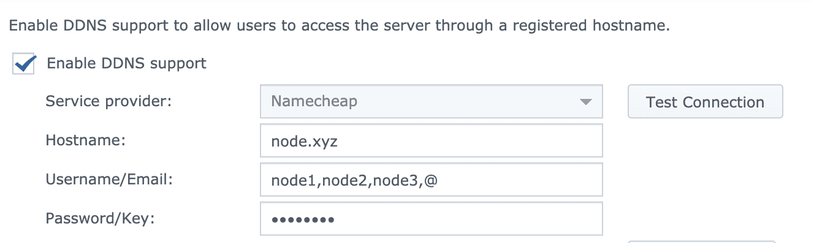

Modified from https://gist.github.com/j796160836/2e015e81d7a0e31de388d94576973700

Synology and Namecheap Update multiple A + Dynamic DNS Records resolving issue `You can only enter one hostname for each DDNS provider.`


* Copy namecheap.php file to /usr/syno/bin/ddns/namecheap.php at Synology.

* Add the following entry in /etc.defaults/ddns_provider.conf

```
[Custom - Namecheap]
        modulepath=/usr/syno/bin/ddns/namecheap.php
        queryurl=dynamicdns.park-your-domain.com

```

Change mode:
`chmod ugo+rwx /usr/syno/bin/ddns/namecheap.php`





#### Note:

Simultaneous cURL requests using curl_multi_exec in PHP
https://webkul.com/blog/simultaneous-curl-requests-in-php/
